# NimapTest

This project was generated with [Angular CLI](https://github.com/angular/angular-cli). Made in 2 days using Angular only by implenting routing and data binding. This is pure SPA. All logics behind this project are my own. As a fresher, took help from StackOverFlow for errors resolving.

## Development server

Run `ng serve` for a dev server. Navigate to `http://localhost:4200/`. The app will automatically reload if you change any of the source files.

**I can improve and add so many customization in this project but due to less time,I couldn't yet I did my best. Hope you like and appreciate this.**

## This is our Home Page.
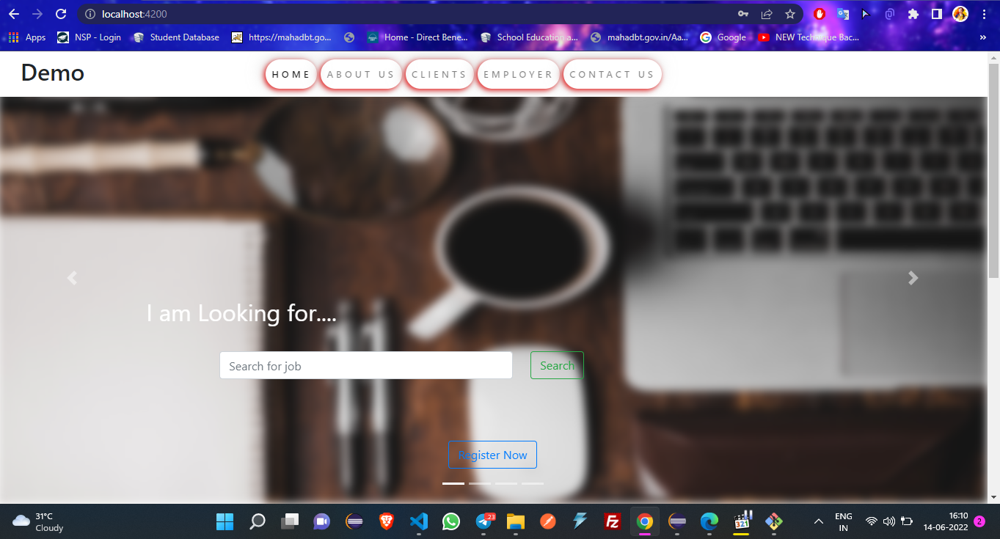

## After Scroll Down.
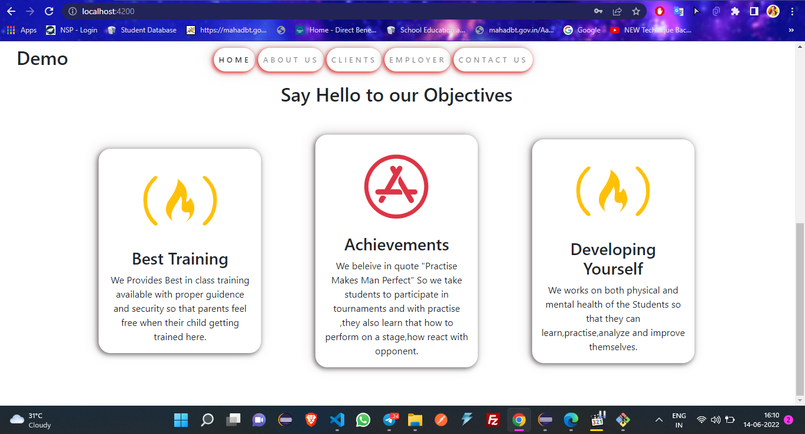

## About Us.
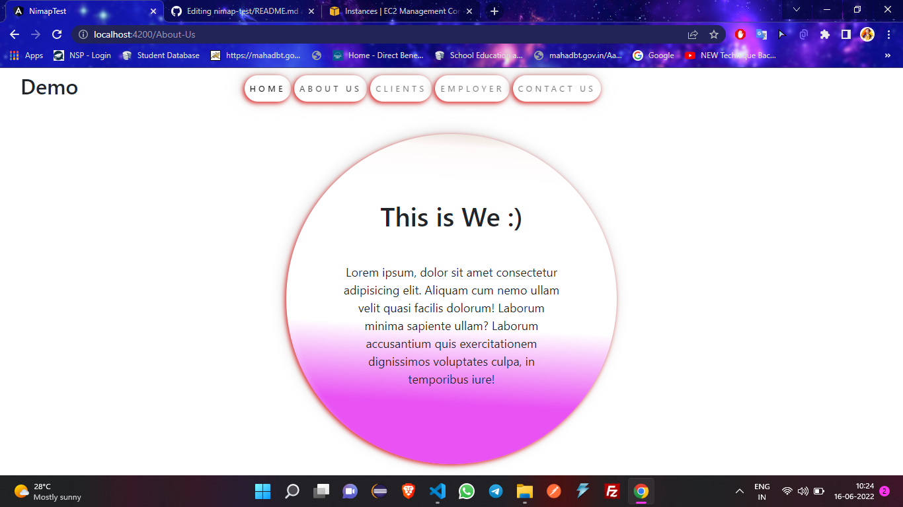

## Clients Component.
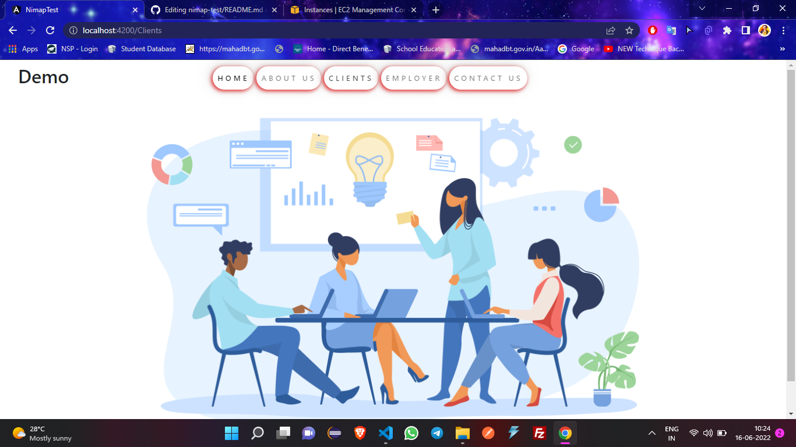

## Employer Component.
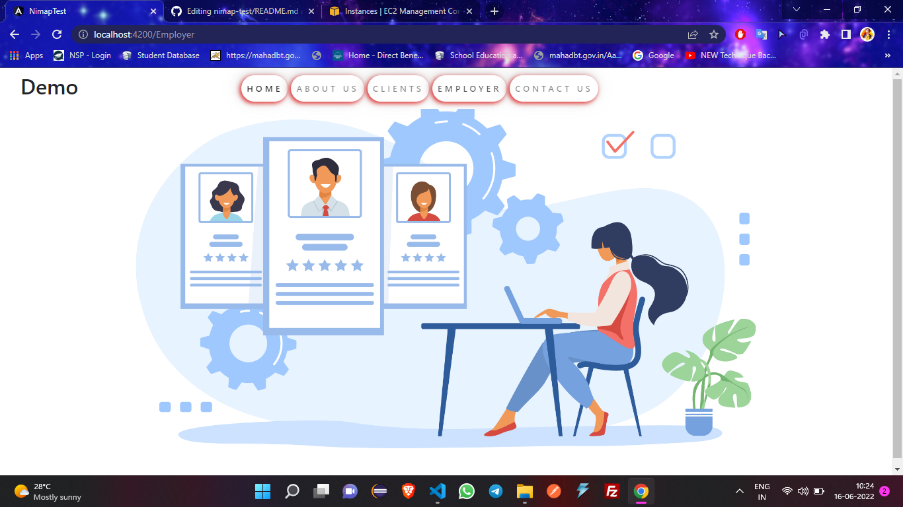

## Contact Us Component.
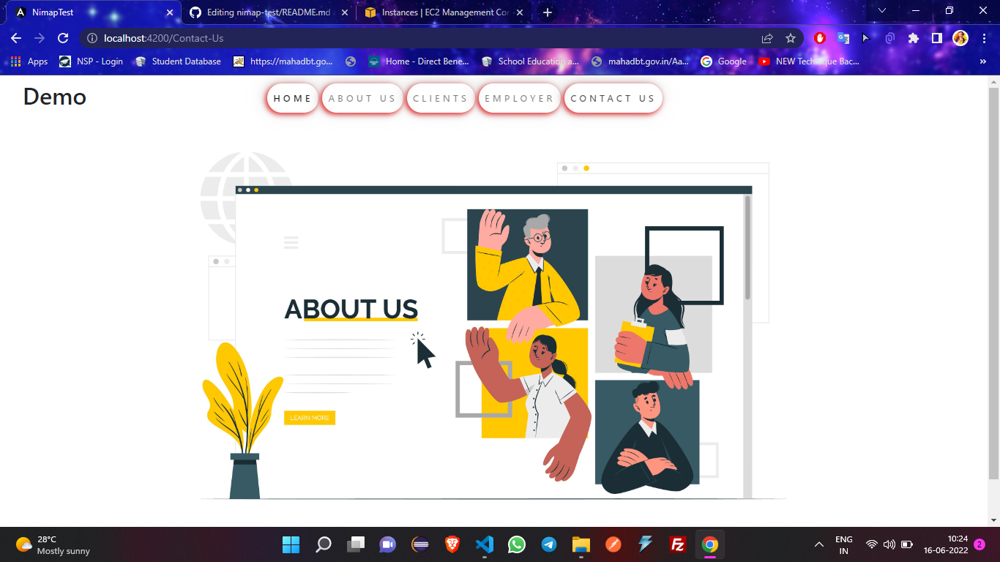

## Register Page on Pop up
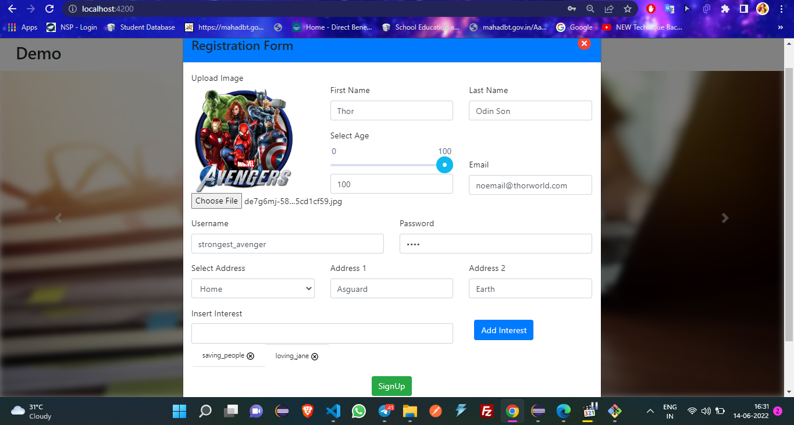

## Validation
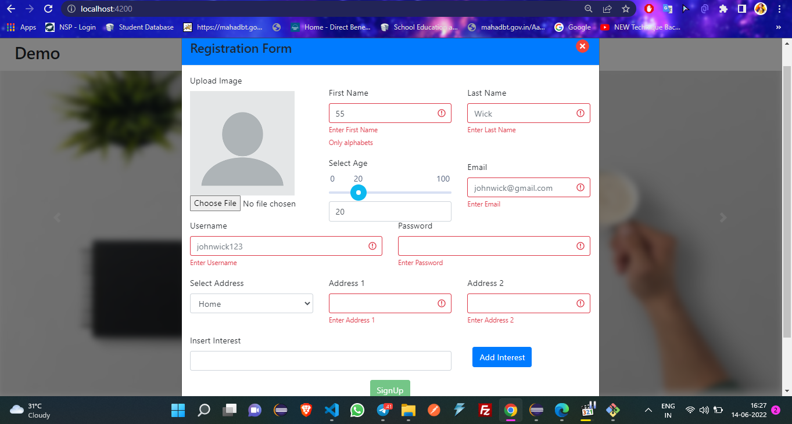

## After Submit Profile Page
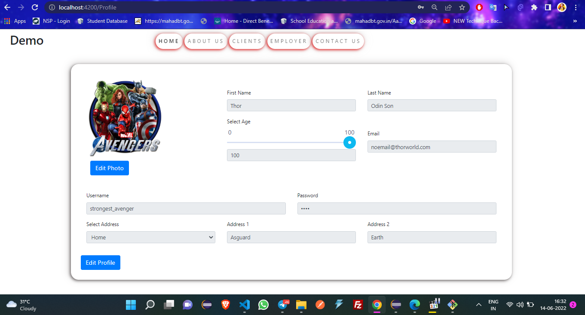

## Editing Profile Details
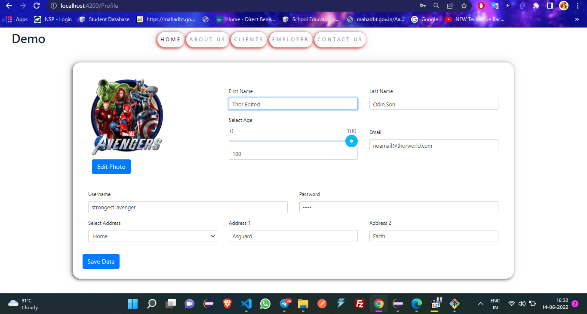

## After Editing Photo and Profile Details
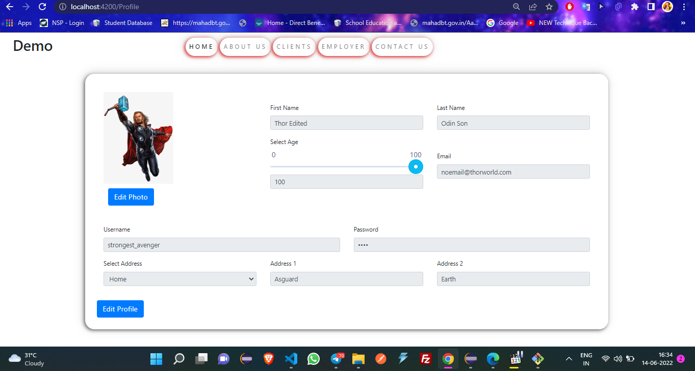
